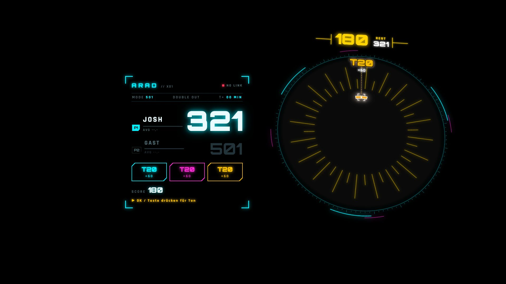
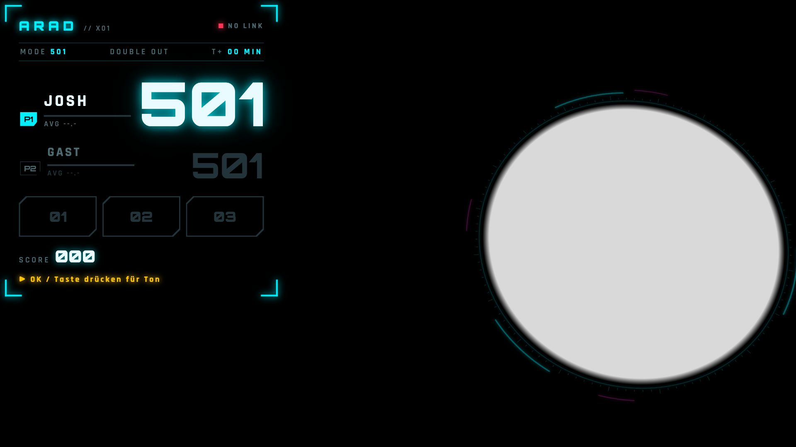
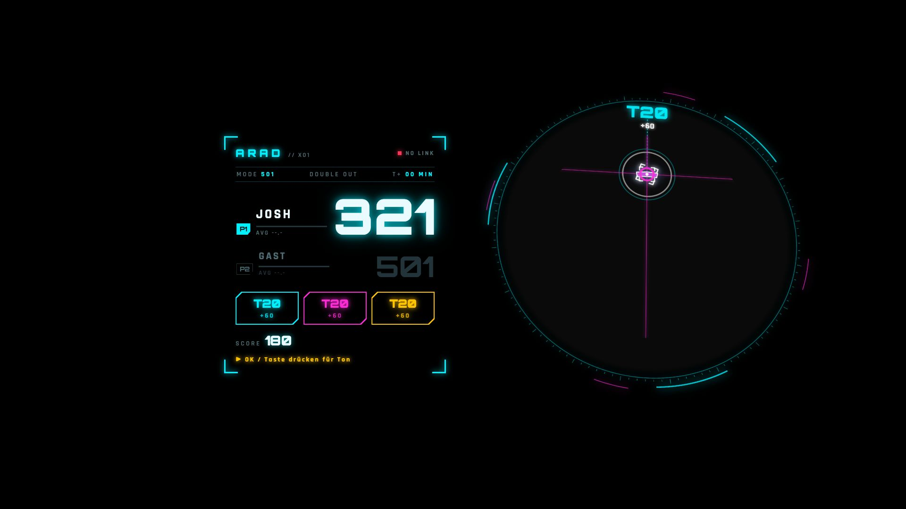
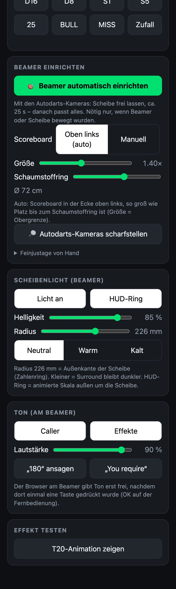

# ARAD – Augmented Reality Auto Darts

Eine Steeldart-Scheibe mit automatischer Wurferkennung (Autodarts) und einem Beamer, der **direkt auf die Scheibe projiziert**: Scheibenlicht, Trefferanimationen, Scoreboard daneben und ein Caller, der ansagt.



## Was es macht

- **Scheibenlicht:** Der Beamer beleuchtet nur die Scheibe. Alles andere bleibt dunkel.
- **Scoreboard:** Das X01-Scoreboard steht neben der Scheibe (301/501/701, Double-Out, Bust, 3-Dart-Schnitt, Checkout-Vorschlag). Die Restpunkte zählen nach jedem Dart herunter.
- **Show nach der Aufnahme:** Die Darts rasten nacheinander mit Fadenkreuz auf den getroffenen Feldern ein. Danach zählt die Summe auf dem Surround hoch. Bei 180, Bust und Checkout gibt es eigene Effekte.
- **Caller:** „One hundred and eighty!“, „Bust!“, „Josh, you require 121.“ – die Ansagen kommen offline über [Piper](https://github.com/rhasspy/piper), dazu kommen Sci-Fi-Soundeffekte. Der Ton läuft über den Lautsprecher des Beamers.
- **Einrichtung per Knopfdruck:** Der Beamer blendet codierte Punktmuster ein, die Autodarts-Kameras erkennen sie, und daraus berechnet sich die Lage der Scheibe im Beamerbild. Die Abweichung liegt typisch unter 1 mm. Du brauchst dafür kein Handy und musst keine Punkte ziehen.
- **Handy-Fernbedienung:** Spiel starten, Testwürfe, Licht, Ton, Einrichtung.

| Beamerbild in Ruhe | Treffer | Handy-Fernbedienung |
|---|---|---|
|  |  |  |

## Aufbau

```
 Kameras (USB) ──► Autodarts (Board, Port 3180) ──WebSocket──► ARAD-Bridge (Node, Port 8090)
                                                                 │  zählt X01, speichert Kalibrierung,
                                                                 │  Caller (Piper), Einrichtung
                                          WebSocket /ws ◄────────┤
             Beamer-Browser (Xiaomi L1): /          Handy: /remote
```

Die Bridge braucht nur Node ≥ 18 (empfohlen: 22+) und hat keine npm-Abhängigkeiten. Autodarts und die Bridge laufen auf demselben Rechner. Wir nutzen einen Fujitsu Futro S740 Thin Client mit Linux Mint.

## Hardware

- Steeldart-Scheibe mit Surround (Schaumstoffring)
- Kameras für Autodarts, zum Beispiel OV9732 USB-Module mit 100° Blickwinkel. 3 sind empfohlen, 2 funktionieren auch.
- Rechner für Autodarts: x86 mit Linux, zum Beispiel ein gebrauchter Thin Client
- Beamer mit Browser, zum Beispiel Xiaomi Smart Projector L1 (Google TV mit einem Browser aus dem Play Store)
- Optional: 3D-gedruckter Kameraring. CAD-Skripte liegen unter [`cad/`](cad/), fertige STL-Dateien unter [`print/stl/`](print/stl/).
- Optional: LED-Ringlicht über einen Pi Zero, siehe [`led/`](led/). Normalerweise übernimmt der Beamer das Licht.

## Schnellstart

Die ausführliche Anleitung steht in **[docs/EINRICHTUNG.md](docs/EINRICHTUNG.md)**. Kurz:

1. Autodarts headless auf dem Rechner installieren, das Board anmelden, die Kameras zuweisen und kalibrieren.
2. Vom eigenen Rechner aus die ARAD-Software aufspielen:
   ```bash
   bash setup/deploy.sh benutzer@autodarts-rechner
   ```
3. Am Beamer `http://<rechner>:8090/` öffnen, am Handy `http://<rechner>:8090/remote`.
4. Die Scheibe leer lassen und in der Remote **🎯 Beamer automatisch einrichten** tippen.

## Status

Das ist ein Hobbyprojekt und läuft im Alltag. Die Erkennung übernimmt [Autodarts](https://autodarts.io). Das ist keine Open-Source-Software, und du brauchst ein Autodarts-Konto. ARAD liest nur die lokale Schnittstelle von Autodarts aus.
